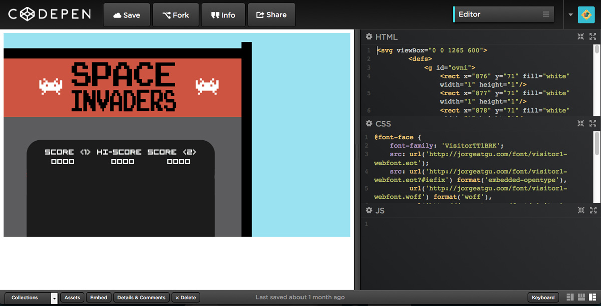

# Introducción

**SVG** es el acrónimo de **Scalable Vector Graphics**, un formato para crear archivos vectoriales en dos dimensiones. En estos momentos **SVG** está en la versión 1.1 y se espera que **SVG 2** se convierta en recomendación a finales de 2014.

Este libro es una introducción bastante amplia a todos los elementos que tenemos disponibles en la especificación de **SVG 1.1**, espero que al final de este libro seas capaz de interpretar esa maraña de código que obtenemos al exportar **SVG** desde programas vectoriales como **Inkscape, Illustrator y Sketch**. También que seas capaz de crear por tu cuenta tus propios archivos **SVG** ayudado solamente de un editor de texto y tu imaginación :)

## Un poco de historia

En 1996 **Chris Lilley** redactó un documento en el que incluía una serie de [requisitos generales](http://www.w3.org/Graphics/ScalableReq.html) para crear un formato vectorial estándar para la web. En 1998 ya se habían presentado seis propuestas que competían por ser el estándar.

- **DrawML**, por parte de **Excosoft**.
- **Hyper Graphics Markup Language**, por parte de **Orange, PCSL, y PRP**.
- **PGML**, por parte de **Adobe, IBM, Netscape y Sun**.
- **VML**, por parte de **Autodesk, HP, Macromedia y Microsoft**.
- **WebCGM**, por parte de **Boeing, CCLRC, Inso, JISC y Xerox**.
- **Web Schematics**, por parte de **CCLRC**.

El grupo de trabajo de **SVG** después de estudiar las propuestas decidió no desarrollar ninguna de las seis que se habían presentado, decidió crear **SVG** partiendo de una serie de características como las curvas bezier, las máscaras y la composición, aunque recibieron muchas influencias como la compresión de **VML**, las coordenadas, transformaciones, texto y fuentes de **PGML** se puede decir que **SVG** fue diseñado desde cero.

**SVG** es una recomendación de la **W3C** desde el año 2001.

## Soporte

Al final del capítulo o de la sección del capítulo aparecerá una tabla con el icono de cada uno de los navegadores acompañado por un visto bueno si da soporte a ese elemento o una cruz si no da soporta a ese elemento.

Para testear los ejemplos del libro he utilizado el sistema operativo **OSX Mavericks 10.9.4**, las versiones de los diferentes navegadores son las siguientes: **Google Chrome 35.0, Mozilla Firefox 30.0, Opera 22.0, Safari 7.0**. Para testear los ejemplos en **Internet Explorer 9, 10 y 11** he tenido que recurrir a las máquinas virtuales que están disponibles para su descarga en la página [modern.ie](https://www.modern.ie/en-us/virtualization-tools) de **Microsoft**.

Para testear los ejemplos en dispostivos móviles he utilizando un **iPhone** con **iOS7.1.2**, un **iPad** con **iOS5.1.1** y un **Samsung** con **Android 4.0.3**. Para completar el soporte podéis utilizar [CanIuse](http://www.caniuse.com/#cats=SVG).

El soporte de los navegadores a los filtros como vais a ver a lo largo del capítulo 7 es muy variado, en algunos filtros el efecto que vemos es diferente si cambiamos de navegador, he detallado en cada filtro el soporte en los navegadores y los cambios que he visto en la pantalla.

## Formato y ejemplos

Todos los ejemplos de este libro van incluídos en un archivo **HTML** con el ***doctype*** de **HTML5**, y es que gracias a **HTML5** podemos añadir el código de nuestros archivos **SVG** dentro del **HTML** y ver el resultado si abrimos el archivo en un navegador como **Chrome, Firefox, Opera, Safari y IE9+**. Solamente **HTML5** deja incluir código **SVG** en línea dentro de sus etiquetas.

Todos los ejemplos están disponibles para su descarga en un archivo zipeado que podéis descargar desde [esta dirección](http://jorgeatgu.com/libro/ejemplos-libro-scalable.zip). También están disponibles en **CodePen** para así poder manipular el código de los ejemplos y ver sus resultado en directo.

Si queréis utilizar el código de los ejemplos os recomiendo copiar y pegar de **CodePen** o del archivo con los ejemplos zipeados, el motivo es sencillo, y es que en **LeanPub** cuando el código ocupa más del ancho de la página parte el código de los ejemplos añadiendo una molesta \ si copiáis y pegáis el código os la vais a llevar a vuestros documentos, así que mejor del zip o de **CodePen.**

Por desgracia los que estéis leyendo este libro en formato **PDF** vais a tener que ir al final de la página y hacer click en la nota al pie ya que las imágenes con enlaces no funcionan, he intentado buscar una solución y no he encontrado nada que funcione conforme es debido, mis más sinceras disculpas. Si estas leyendo este libro en formato **.mobi** o **.epub** los enlaces funcionan a la perfección.

Para editar los archivos que están en **CodePen** no es obligatorio estar registrado.

Para acceder a los ejemplos alojados en **CodePen** hay que pinchar en el logo de **CodePen**.

Cuando hacemos click vamos a ver una pantalla como esta.

Ahora vamos a hacer click en ***details*** y luego hacemos click en ***editor***

Ahora vamos a ver la imagen con tres celdas en las que se aloja el código **HTML, CSS y JS**.

A nosotros en esta ocasión solamente nos interesa el **HTML**, así que vamos a hacer click en el icono que esta situado a la derecha del todo, al hacer click en este ícono vamos a expandir el **HTML** y ocultar las celdas de **CSS** y **JS**.

Ahora solamente tenemos que editar el ejemplo con los valores que queramos.
