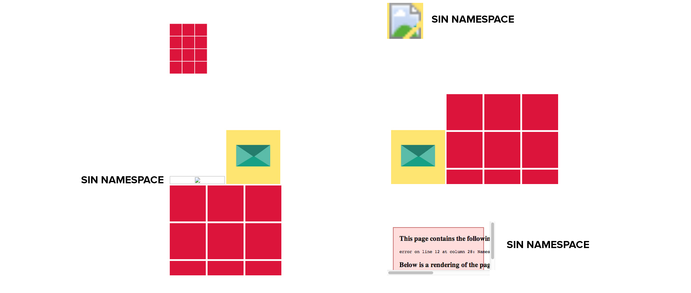
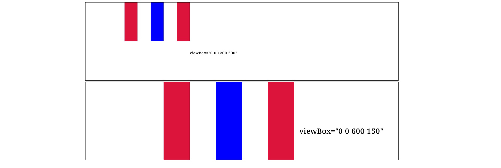
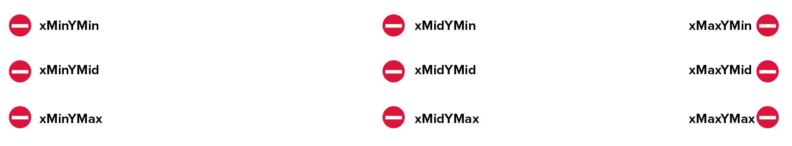
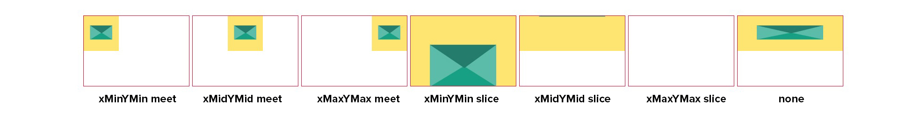

# Etiqueta principal

La etiqueta principal de **SVG** es la que contiene dentro de ella los elementos que forman nuestro documento. La propia etiqueta dispone de una serie de atributos para posicionar y determinar tanto sus medidas como su localización.

Podemos posicionar nuestro documento en la coordenada horizontal con ***x***, y en la vertical con ***y***. Su valor por defecto es de 0.

Para determinar las medidas que va a tener nuestro archivo tenemos el ***width*** y el ***height***. Su valor por defecto es de 100%.

Con el ***namespace*** `xmlns="http://www.w3.org/2000/svg"` le indicamos al navegador que nuestro archivo es **XML**. Si vamos incluir **SVG** a través de **HTML** con las etiquetas `` y `<object>` vamos a necesitar este ***namespace***, si no lo incluimos no sé va a mostrar la imagen. En cambio si vamos a incluir nuestro **SVG** como código en línea dentro de etiquetas **HTML5** no vamos a necesitar los ***namespaces***, pero esto cambia si dentro de estas etiquetas incluimos un **SVG** a través de la propía etiqueta que tiene **SVG** para añadir imágenes `<image>` entonces si que vamos a necesitar el ***namespace*** para mostrar la imagen.

En mi opinión como no sabemos el camino que va a recorrer nuestro **SVG** y como puede ser incluído de varias maneras, en línea dentro de **HTML5**, en etiquetas `` `<object>` `<iframe>` `<embed>`, a través de la propia etiqueta `<image>` de **SVG** y también como `background-image` en **CSS**, sin olvidarnos de que también puede ser incluido a través de **data-URI** lo mejor que podemos hacer es incluir estos dos ***namespaces*** que apenas ocupan espacio y que como ya hemos visto anteriormente son incluidos a la hora de exportar desde programas vectoriales como **Inkscape, Illustrator y Sketch**.

~~~~~~~
<svg xmlns:xlink="http://www.w3.org/1999/xlink" xmlns="http://www.w3.org/2000/svg" viewBox="0 0 600 250" width="600" height="250">
       <image xlink:href="cuadrado.svg" width="200" height="200"/>
</svg>
<svg xmlns:xlink="http://www.w3.org/1999/xlink" xmlns="http://www.w3.org/2000/svg" viewBox="0 0 600 250" width="600" height="250">
     <image xlink:href="sobre.svg" width="100" height="100"/>
     <image xlink:href="sinsobre.svg" width="100" height="100"/>
</svg>

     
     
     <object data="sinsobre.svg" type="image/svg+xml"></object>
     <object data="sobre.svg" type="image/svg+xml"></object>
     
     
     <object data="cuadrado.svg" type="image/svg+xml"></object>
     <object data="cuadradosin.svg" type="image/svg+xml"></object>

~~~~~~~

En el ejemplo se ve lo que ocurre cuando tratamos de incluir un **SVG** en el HTML que no contiene los ***namespaces***, en este caso los archivos que no contienen ***namespaces*** son `sinsobre.svg` y `cuadradosin.svg`.

####Soporte

## Sistema de coordenadas y unidades de medida

El sistema de coordenadas que utiliza **SVG** está compuesto por el valor horizontal que está representado por `x=”0”` y el vertical que está representado por `y=”0”`, el sistema de coordenadas por defecto sera con los dos valores a cero, así que comenzará en la esquina superior izquierda.

La unidad de medida por defecto es el **pixel**, así que si no especificamos valor alguno la unidad de medida utilizada será el **pixel**.

**SVG** también acepta las siguientes unidades de medida:

- **CM** > centímetros, equivale a 35.43px
- **EM** > es relativa al tipo de letra que se esté usando, suele equivaler a 16px
- **EX** > es relativa a la altura de la letra x minúscula de la fuente que se esté usando
- **IN** > pulgadas, equivale a 90px
- **MM** > milímetros, equivale a 3.54px
- **PC** > picas, equivale a 15px
- **PT** > puntos, equivale a 1.25px
- **PX** -> pixels

## viewBox

Con el atributo ***viewBox*** definimos el área que queremos que sea visible dentro de un **SVG**.
El atributo se define con cuatro valores, los dos primeros corresponden a las coordenadas ***min-x*** y ***min-y***, los dos siguientes a la anchura y altura con ***width*** y ***height***. Los valores estarán separados por espacios en blanco o comas. Ni ***width*** ni ***height*** admiten valores negativos.

En el ejemplo que vamos a ver a continuación tanto el ***width*** y el ***height*** comparten los mismo valores con el ***viewBox***, 1200 de ***width*** y 300 de ***height***, por lo tanto no vamos a ver ningún efecto.

~~~~~~~
<svg x="0" y="0" width="1200" height="300" viewBox="0 0 1200 300">
    <rect x="150" y="100" width="150" height="150" fill="crimson"/>
    <rect x="250" y="100" width="150" height="150" fill="blue"/>
    <rect x="350" y="100" width="150" height="150" fill="crimson"/>
</svg>
~~~~~~~

En el ejemplo que vamos a ver a continuación todas las medidas son iguales que en el anterior ejemplo a excepción del ***viewBox***, el cual ahora tiene un ***width*** de 600 y un ***height*** de 150, estas medidas hacen un efecto de zoom sobre el documento reduciendo las dimensiones del documento y multiplicando por dos el tamaño las figuras y del texto.

~~~~~~~
<svg x="0" y="300" width="1200" height="300" viewBox="0 0 600 150">
    <rect x="150" y="100" width="150" height="150" fill="crimson"/>
    <rect x="250" y="100" width="150" height="150" fill="blue"/>
    <rect x="350" y="100" width="150" height="150" fill="crimson"/>
</svg>
~~~~~~~

En la siguiente imagen vamos a ver la comparación entre los dos ***viewBox***, y el efecto de zoom que genera la reducción del ***viewBox*** en el segundo archivo.

####Soporte

## preserveAspectRatio

Cuando las medidas del atributo ***viewBox*** no coinciden con las del documento ***width*** y ***height*** podemos especificar a través del ***preserveAspectRatio*** cómo vamos a encajar el contenido en el documento. Si no declaramos el atributo ***viewBox*** el ***preserveAspectRatio*** no se va a tener en cuenta.

El atributo ***preserveAspectRatio*** consta de dos valores separados por un espacio. El primero está compuesto por dos partes que indicarán cómo vamos a alinear el objeto en el documento, la primera para la coordenada ***x*** y la segunda para la coordenada ***y***.

- ***xMin***	Alinea la coordenada ***x*** con la esquina superior izquierda.
- ***xMid***	Alinea la coordenada ***x*** con el centro.
- ***xMax***	Alinea la coordenada ***x*** con la esquina inferior izquierda.

- ***YMin***	Alinea la coordenada ***y*** con la esquina superior izquierda.
- ***YMid***	Alinea la coordenada ***y*** con el centro.
- ***YMin***	Alinea la coordenada ***y*** con la esquina inferior izquierda.

Vamos a ver un ejemplo que incluye varias, cada combinación ocupa el 33% del ancho del documento y el 10% del alto para que así podamos ver todas las opciones en el mismo documento. A parte y para que se vea por separado el efecto de cada combinación he creado un ejemplo con cada combinación.

- La primera combinación es ***xMinYMin*** se alinea con la esquina superior izquierda.
- La segunda combinación es ***xMidYMin*** se alinea en parte superior central.
- La tercera combinación es ***xMaxYMin*** se alinea con la esquina superior derecha.
- La cuarta combinación es ***xMinYMid*** se alinea en el centro izquierda.
- La quinta combinación es ***xMidYMid*** se alinea en el centro.
- La sexta combinación es ***xMaxYMid*** se alinea con el centro derecha.
- La septima combinación es ***xMinYMax*** se alinea con la esquina inferior izquierda.
- La octava combinación es ***xMidYMax*** se alinea en parte inferior central.
- La novena combinación es ***xMaxYMax*** y se alinea con la esquina inferior derecha.

En el código que vais a ver a continuación para que se asocie mejor el efecto con la imagen sólo he dejado el la etiqueta principal con su valores, el resto del código lo podéis consultar en **CodePen** o en los archivos del .zip

~~~~~~~
<svg viewBox="0 0 60 80" width="33%" height="10%" preserveAspectRatio="xMinYMid">
</svg>
<svg viewBox="0 0 60 80" width="33%" height="10%" preserveAspectRatio="xMidYMid">
</svg>
<svg viewBox="0 0 60 80" width="33%" height="10%" preserveAspectRatio="xMaxYMin">
</svg>
<svg viewBox="0 0 60 80" width="33%" height="10%" preserveAspectRatio="xMinYMid">
</svg>
<svg viewBox="0 0 60 80" width="33%" height="10%" preserveAspectRatio="xMidYMid">
</svg>
<svg viewBox="0 0 60 80" width="33%" height="10%" preserveAspectRatio="xMaxYMid">
</svg>
<svg viewBox="0 0 60 80" width="33%" height="10%" preserveAspectRatio="xMinYMax">
</svg>
<svg viewBox="0 0 60 80" width="33%" height="10%" preserveAspectRatio="xMidYMax">
</svg>
<svg viewBox="0 0 60 80" width="33%" height="10%" preserveAspectRatio="xMaxYMax">
</svg>
~~~~~~~

####Soporte

### Meet y Slice

Por último vamos a ver el segundo valor que le podemos dar a ***preserveAspectRatio***, este valor es opcional y tiene tres opciones, **meet** que es su valor por defecto, ***slice*** y ***none***. Con ***meet*** lo que hacemos es encajar el objeto dentro de las medidas del documento. Con ***slice*** lo que hacemos es es que en el caso de que el objeto sea mayor que las medidas del documento el objeto se saldrá del propio documento donde está ubicado. La última es ***none***, el objeto se escala de la manera que sea para encajar en el documento, lo más probable es que el objeto quede distorsionado.

En el código que vais a ver a continuación para que se asocie mejor el efecto con la imagen sólo he dejado el la etiqueta principal con su valores, el resto del código lo podéis consultar en **CodePen** o en los archivos del .zip

~~~~~~~
<svg preserveAspectRatio="xMinYMin meet">
</svg>
<svg preserveAspectRatio="xMidYMid meet">
</svg>
<svg preserveAspectRatio="xMaxYMax meet">
</svg>
<svg preserveAspectRatio="xMinYMin slice">
</svg>
<svg preserveAspectRatio="xMidYMid slice">
</svg>
<svg preserveAspectRatio="xMaxYMax slice">
</svg>
<svg preserveAspectRatio="none">
</svg>
~~~~~~~

####Soporte

### DEMO INTERACTIVA

A continuación os dejo una demo interactiva de [Sara Soudeian](http://sarasoueidan.com/) donde podemos modificar los valores del ***viewBox*** y ver sus resultados, sin duda alguna nos terminará de ayudar a comprender este elemento de **SVG**.

[DEMO SVG COORDENADAS](http://sarasoueidan.com/demos/interactive-svg-coordinate-system/index.html)
