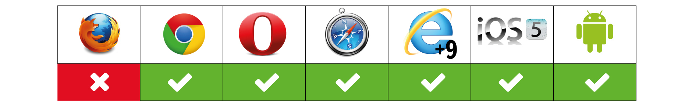

# Texto

Vamos a ver como podemos añadir texto a nuestros documentos, para ello tenemos disponible las etiquetas `<text> <tspan> <textPath>` también tenemos disponible la etiqueta `<tref>` pero no voy a hablar de ella ya que va a dejar de formar parte de la especificación en **SVG 2**.

Antes de empezar a comentar las etiquetas hay que tener en cuenta que si queremos utilizar un tipo de fuente que no esté dentro de las ***web safe fonts***, es decir las fuentes seguras que ya están instaladas en **Mac OSX, Linux y Windows,** tenemos que recurrir a la regla de **@font-face** de **CSS3** o a servicios gratuitos como [Google Fonts](https://www.google.com/fonts) o [Typekit](http://www.typekit.com)(la primera web es gratuita).

## Text

Para añadir texto en **SVG** tenemos la etiqueta `<text>`. El texto como el resto de elementos que hemos visto a lo largo del libro lo podemos posicionar horizontalmente en el documento con la coordenada ***x***, y verticalmente con la coordenada ***y***. También disponemos del atributo ***textLength*** para añadir espacio a las letras, ***rotate*** para rotar, y ***lengthAdjust*** para ajustar.

~~~~~~~
<text x="100" y="120" fill="red">Texto sin nada.</text>
<text x="100" y="160" fill="red" rotate="25">Texto con rotate(25)</text>
<text x="100" y="200" fill="red" textLength="1000">Texto con textLength(1000)</text>
<text x="100" y="240" fill="red" textLength="1000" lengthAdjust="spacingAndGlyphs">Texto con textLength(1000) y lengthAdjust(spacingAndGlyphs)</text>
<text x="100" y="280" fill="red" textLength="1000" lengthAdjust="spacing">Texto con textLength(1000) y lengthAdjust(spacing)</text>
~~~~~~~

####Soporte

## Tspan

La etiqueta `<tspan>` nos permite posicionar absolutamente o relativamente los caracteres que incluimos dentro de la etiqueta, además también podemos resaltar solamente uno o varios caracteres y cambiarlo de color o rotarlo.

Vamos a hacer varias combinaciones para ver lo que podemos hacer.

~~~~~~~
<text x="50" y="50" fill="red">Este texto es normal.
	<tspan font-size="40" fill="olive">Este texto va en un tspan</tspan>
</text>
<text x="50" y="200" fill="red">Este texto es normal.
  	<tspan fill="blue" dx="-200" dy="50">Este texto va en un tspan</tspan>
</text>
<text x="50" y="500" fill="red"> Este texto es normal.
<tspan fill="blue" x="30 60 100 200 250 350 400 500 550" y="550">Esto tspan</tspan>
</text>
~~~~~~~

- En el primero cambiamos el color del texto y aumentamos el tamaño de la letra.
- En el segundo modificamos la posición de las coordenadas ***x*** e ***y***.
- En el tercero modificamos la posición de cada uno de los caracteres.

####Soporte

## textPath

Con la etiqueta `<textPath>` logramos que un texto fluya a lo largo de un `<path>` que hemos declarado previamente. El path donde fluya el texto deberá ir referenciado con un ***ID***. Este ***ID*** se lo pasaremos al ***textPath*** con `xlink:href=”#ejemplo”`, a través del atributo ***startOffset*** vamos a indicarle donde queremos que empiece a fluir el texto, por defecto su valor es de 0%.

~~~~~~~
<defs>
	<path id="ejemplo" d="M197,167.5c0,0,433-285.5,433,0"/>
</defs>
<text fill="crimson">
	<textPath xlink:href="#ejemplo"> Este texto va dentro de un textPath
	</textPath>
</text>
<g transform="translate(0 100)">
	<text fill="crimson">
	<textPath xlink:href="#ejemplo" startOffset="20%">Este texto con startOffset(20%)
	    </textPath>
    </text>
</g>
~~~~~~~

####Soporte

